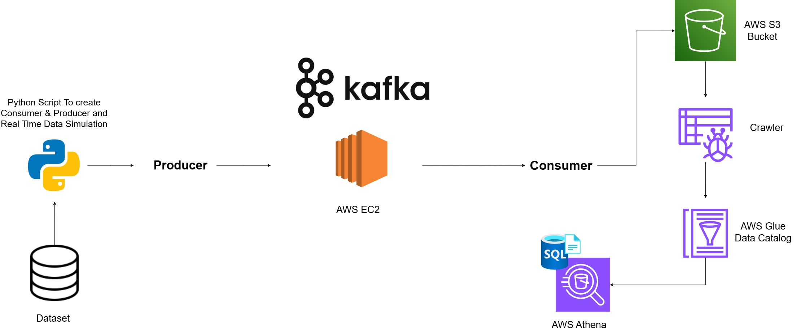

# RealTime_Data_Streaming_Pipeline_Kafka_S3_Athena

## Project Overview: 
This project builds a real-time data streaming pipeline using AWS services. Kafka producers send high-throughput data streams, while Kafka consumers process and push the data to S3 for storage. EC2 hosts the Kafka brokers and consumer applications. AWS Glue Crawlers infer the schema of the data in S3 and populate the Glue Data Catalog. Athena is used to query the data directly from S3 for efficient, serverless SQL-based analysis.

## Key Features:

**Real-Time Data Streaming with Kafka on EC2:** Kafka producers send real-time data, and Kafka consumers process it. Kafka is hosted on EC2 instances to handle the high-throughput data streams, ensuring smooth and continuous data flow.

**Data Storage in S3:** Processed data from Kafka is stored in Amazon S3, which is cost-effective and easily accessible for further processing or analysis.

**Automatic Schema Detection with Glue:** AWS Glue Crawlers automatically detect the structure of data stored in S3, eliminating the need to manually define schemas.

**Easy Data Querying with Athena:** Athena allows you to run SQL queries directly on the data stored in S3, enabling fast analysis without managing infrastructure.

## Architecture:

## Technology Used:
1.Programming Language - Python

2.Amazon Web Service (AWS)

3.S3 (Simple Storage Service)

4.Athena

5.Glue Crawler

6.Glue Catalog

7.EC2

8.Apache Kafka
